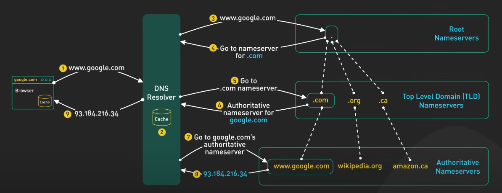

# DNS, HTTP(S), Routing, and the Request-Response Cycle

### DNS (Domain Name System)

> **The Internet’s Phonebook**

**DNS** translates human-friendly domain names (like `www.example.com`) into machine-readable IP addresses (like `192.0.2.1`). This lets users access websites by name, without needing to remember complex numbers.

* **Hierarchy:** DNS is structured in a tree-like fashion, with root servers at the top, followed by TLDs (like `.com`, `.org`), and then domain names and subdomains.
* **How it works:** When you enter a website address, your device queries DNS servers to find the corresponding IP address. This process may involve several servers until the correct one is found.

<figure><figcaption>
DNS
</figcaption></figure>





***

## HTTP and HTTPS

> The Messengers of the Web

### HTTP **(Hypertext Transfer Protocol)**

**HTTP (Hypertext Transfer Protocol)** is the most widely used protocol on the web to transfer data between your browser and a website’s server. It works on a request-response model: your browser sends a request, and the server sends back a response with the requested information.

#### **What is HTTP?**

* HTTP is an application layer protocol, part of the TCP/IP suite.
* It enables web-based applications to communicate and exchange data, including images, videos, documents, and other multimedia content.
* Think of HTTP as the messenger that delivers requests and responses between your browser and the website’s server.

#### **Key Features of HTTP:**

* **Connectionless:** After sending a request, the client disconnects from the server. When the response is ready, a new connection is established to deliver it.
* **Stateless:** Each request is independent. The server does not remember previous requests from the same client. Any state or session information must be managed separately.
* **Data Flexibility:** HTTP can deliver any type of data, as long as both client and server can interpret it.

#### **How HTTP works**:

* You type a URL or click a link.
* Your browser sends an HTTP request to the server.
* The server processes the request and sends back an HTTP response (with a status code, headers, and data).
* Your browser displays the content.

### **HTTPS (Hypertext Transfer Protocol Secure)**:&#x20;

This is the secure version of HTTP. HTTPS encrypts the data exchanged between your browser and the server, protecting sensitive information like passwords and payment details.

#### **How HTTPS works**:

* The browser connects to the server using HTTPS.
* The server sends its SSL/TLS certificate to the browser.
* The browser verifies the certificate.
* An encrypted connection is established.
* All data is encrypted before being sent and decrypted upon arrival.



***

## Routing

> **Directing Traffic on the Internet**

**Routing** determines how data packets travel from one point to another across the Internet.

### **How routing works:**

* Routers (networking devices) use algorithms to find the best path for data.
* They exchange information about network paths and forward packets toward their destinations.

### **Importance:**

* Efficient routing ensures data reaches its destination quickly and reliably.

***

## The Request-Response Cycle

> The Heart of Web Communication

The **request-response cycle** is the basic mechanism by which the web operates.

### **How it works:**

1. **User Action:** You type a URL or click a link.
2. **DNS Lookup:** Your browser uses DNS to find the server’s IP address.
3. **Connection Establishment:** The browser connects to the server using TCP/IP.
4. **HTTP Request:** The browser sends an HTTP request to the server. This request includes:
   * **Start Line:** Contains the HTTP method (like GET or POST), the URI (resource path), and the HTTP version.
   * **Headers:** Provide additional information (e.g., host, language, content type)1.
   * **Body:** Optional, contains data sent by the client (used in POST requests, for example)1.
5. **Server Processing:** The server processes the request and prepares a response.
6. **HTTP Response:** The server sends back an HTTP response, which includes:
   * **Start Line:** Contains the HTTP version and a status code (e.g., 200 for success, 404 for not found)1.
   * **Headers:** Additional information about the response.
   * **Body:** The requested resource (like an HTML page or an image)1.
7. **Connection Closed:** The connection is closed after the response is delivered (since HTTP is connectionless)1.

**Multiple Requests:** A single web page may require multiple HTTP requests (for images, scripts, stylesheets, etc.), each following this cycle.


