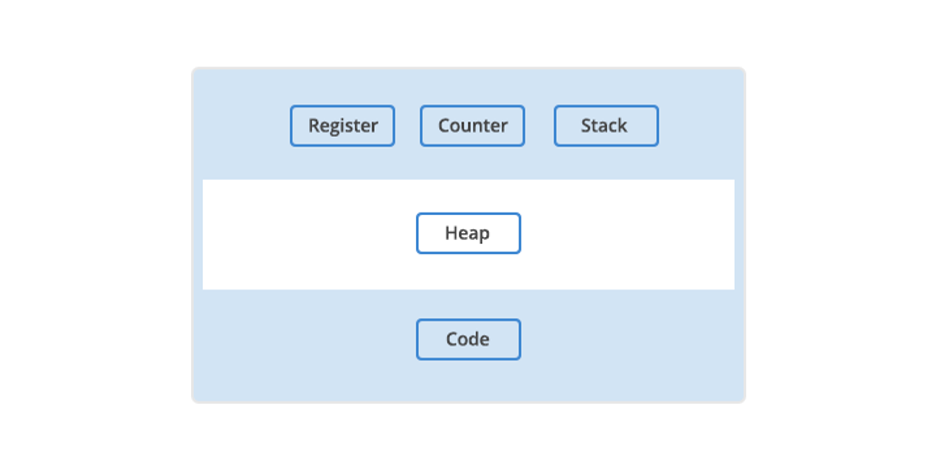
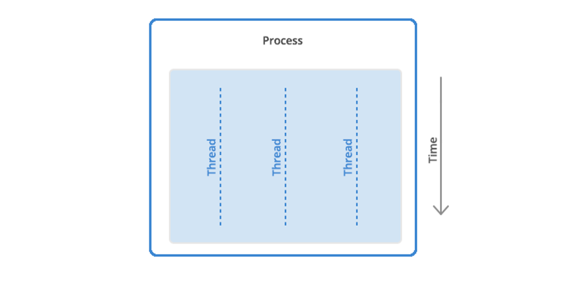

# Programs, Processes, and Threads

💻 **Ever Wondered How Your Device Juggles So Many Tasks at Once?**

From streaming videos while replying to emails to running smooth animations as you scroll, your computer or smartphone handles multitasking like magic. But what’s happening behind the scenes?

Let’s pull back the curtain and uncover the real players: **programs, processes, and threads**. These aren’t just buzzwords tossed around by tech geeks — they’re the invisible engines that keep your digital world running smoothly.

Before we dive deep into how processes and threads work, it’s important to understand the foundation — the **computer program**. Think of a program as a recipe, while processes are the chefs preparing dishes, and threads are the multitasking hands making everything happen at once.

Even if you’re not a tech expert, grasping these basics will help you better understand how your device operates. Whether you’re a curious user, a developer-in-the-making, or someone who simply wants to make smarter tech decisions (like whether to add more RAM), this guide is for you.

🧠 So, get ready to explore how your favourite apps function, what’s going on in your Task Manager or Activity Monitor, and why understanding this stuff can help you spot problems faster and optimise performance.

***

## 🧠 What Is a Computer Program?

A **computer program** is simply a set of instructions that tells your device what to do, like opening a browser, playing a video, or sending a message. These instructions are written by developers using a programming language, which acts as a bridge between human ideas and machine actions.

#### 🛠️ Programming Languages: How We Talk to Machines

Programming languages like Python, JavaScript, C++, and many others help us give commands to computers. Each language has its own rules and style — some are great for speed, while others focus on simplicity and flexibility.

There are two main types of programs:

* **Compiled programs** (like those written in C++) are converted directly into machine code that your computer can run — fast and efficient, but harder to change.
* **Interpreted programs** (like Python or JavaScript) are read and run line by line using another tool called an interpreter. These are easier to test and more flexible across different systems.

#### 💡 Why Do Computers Only Understand 1s and 0s?

At the core, all programs are turned into **binary code** — a series of 1s (on) and 0s (off). This is the only language your computer’s CPU truly understands. So, no matter how fancy a program is, it eventually becomes binary to run.

#### 📦 Where Are Programs Stored?

Programs usually live on your hard drive (non-volatile memory), but they run in **RAM** (volatile memory) when you're using them. RAM is super fast but temporary — when you shut down your computer, its contents are gone. That’s why we store programs on permanent storage but run them in fast memory.

#### 🧰 What Does a Program Need to Run?

To run, every program depends on key resources:

* **Registers**: Tiny storage areas that hold important data.
* **Program Counter**: Keeps track of what the program should do next.
* **Stack**: Temporarily stores info about tasks the program is doing.
* **Heap**: Stores extra data that the program might need while running.

All of this is managed by your **Operating System** (such as Windows, macOS, Linux, Android, etc.), which works in the background to ensure every program gets what it needs.

<figure><figcaption>
The main resources a program needs to run.
</figcaption></figure>

👉 Now that we understand what a **program** is — a set of instructions stored on your computer — let’s move on to what happens when you _run_ that program.

***

## ⚙️ What Is a Computer Process?

When you open an app like Chrome, Spotify, or a game, your computer doesn’t just look at the code — it brings that code to life by loading it into memory and giving it everything it needs to function. At that moment, the **program becomes a process**.

A **process** is simply a running instance of a program — alive, active, and ready to work.

You can even have **multiple processes** from the same program. For example, if you open three Chrome windows, you’re running three separate processes of Chrome.

#### 🧩 How Processes Work Behind the Scenes

Each process has its own private space in memory. That means:

* It runs **independently** from other processes.
* It can’t directly mess with data from another process.
* If it crashes, it won’t affect the others, which is why you can force-close one app without crashing your entire computer.

However, since each process is isolated, switching between them takes a little extra effort from your system. The computer has to **save and reload** information like memory usage, open files, and other resources when moving between processes.

#### ✅ Why This Matters to You

This separation is a safety net. If one program goes haywire (like freezing or crashing), it won’t bring down your whole system. You can just hit "End Task" or "Force Quit" and continue working smoothly.

👉 **So, we now know that a process is a running program with its own memory and resources — but how does it perform multiple tasks at once?** Let’s dive into the world of **threads**, the real workers that help processes multitask efficiently and keep your apps smooth and responsive.

***

## 🧵 What Are Threads?

Meet the final piece of the puzzle: **threads** — the actual _workers_ inside a process.

Think of a **process** as a company, and **threads** as the employees. Just like a company can have one or many employees working on different tasks, a process can have **one or many threads** running tasks simultaneously.

<figure><figcaption>
A process can have anywhere from one thread to many.
</figcaption></figure>

#### 🧑‍💻 Single Thread vs Multi-Thread

* A **single-threaded process** has just one thread — one worker doing one task at a time.
* A **multi-threaded process** has multiple threads — multiple workers doing different jobs, often at (virtually) the same time.

For example, when you're editing a photo in an app:

* One thread might handle the user interface,
* Another might process the image filters,
* And another might save the file in the background.

This teamwork makes your apps feel **fast and responsive**.

<figure><figcaption>
The difference between single thread and multi-thread processes.
</figcaption></figure>

#### 🧠 How Threads Share Memory

Earlier, we talked about memory types:

* Each thread gets its **stack** (a private workspace),
* But they all share the **heap** (a common memory pool).

This shared access makes it **easy for threads to communicate** — they can pass data quickly and work together without the delay that comes with process-to-process communication.

That’s why threads are sometimes called **“lightweight processes.”** They’re efficient, quick, and perfect for multitasking within a process.

#### ⚠️ But There’s a Catch...

Because threads share memory, **one faulty thread** can mess things up for the entire process. If one thread crashes or gets stuck, the whole app might freeze or behave unexpectedly. It's a trade-off between speed and stability.



***

## 🔍 **Computer Process vs Thread: Key Differences Explained Simply**

Let’s think of your computer like a company.

* A **process** is a full **department** with its own office, staff, and resources.
* A **thread** is like an **employee** within that department — faster, lighter, but working within shared boundaries.

Here’s how they stack up:

<table><thead><tr><th width="175">🧩 Aspect</th><th width="280">🏢 Process</th><th width="280">👨‍💼 Thread</th></tr></thead><tbody><tr><td><strong>Definition</strong></td><td>An independent program with its own memory space.</td><td>A lightweight unit of execution inside a process, sharing memory.</td></tr><tr><td><strong>Creation Overhead</strong></td><td>High — each process needs its own memory and resources.</td><td>Low — threads share the same memory space, so they're quicker to create.</td></tr><tr><td><strong>Isolation</strong></td><td>Completely isolated from other processes.</td><td>Threads are not isolated — they share memory with other threads in the process.</td></tr><tr><td><strong>Resource Allocation</strong></td><td>Each process gets its <strong>own copy</strong> of system resources.</td><td>Threads share system resources within the same process.</td></tr><tr><td><strong>Independence</strong></td><td>Processes work independently — one doesn’t impact another.</td><td>Threads are interconnected — one misbehaving thread can affect others.</td></tr><tr><td><strong>Failure Impact</strong></td><td>If one process crashes, others continue unaffected.</td><td>If one thread crashes, it can bring down the whole process.</td></tr><tr><td><strong>Synchronization</strong></td><td>Less synchronization needed due to isolation.</td><td>Needs careful sync mechanisms to avoid conflicts in shared memory.</td></tr><tr><td><strong>Memory Usage</strong></td><td>Typically uses <strong>more memory</strong> due to separate resources.</td><td>More <strong>memory efficient</strong> as they operate within shared space.</td></tr><tr><td><strong>Example Use Case</strong></td><td>Running multiple apps like a browser, editor, and music player simultaneously.</td><td>Handling multiple tabs, tasks, or background operations inside a single app.</td></tr></tbody></table>

### 🔄 Quick Recap: How It All Works Together

Here’s how your computer runs your apps — step by step:

1. You open a program (it starts as written code).
2. The program is compiled or interpreted into binary.
3. It’s loaded into memory and becomes a **process**.
4. That process may contain **one or more threads** to do multiple tasks.
5. Threads work together, sharing memory and resources, to bring your app to life.

### ✅ **Quick Takeaway**

* **Programs:** Blueprints or instructions written in code — they don’t run on their own until executed.
* **Processes:** Active, running versions of programs with their memory and resources.
* **Threads:** Mini-tasks within a process — fast, efficient, and great for multitasking, but they need to play well together.

Let’s explore **how threads supercharge performance** in modern applications through **parallelism and concurrency!**



***

## ⚡ How Threads Supercharge Performance: Parallelism vs Concurrency

Ever wondered how your apps stay fast even when doing multiple things at once — like streaming music while downloading files and running animations?

That’s the magic of **threads**, powered by two powerful concepts: **parallelism** and **concurrency**.

### 🧵 Concurrency: Juggling Tasks Efficiently

Concurrency is like a skilled juggler managing **multiple tasks by switching between them quickly**. Even if tasks aren’t happening at the same time, the switch is so fast that it feels like they are.

💡 **Example:**\
Typing in a chat app while it’s still receiving messages and loading emojis — all handled smoothly, thanks to concurrent threads!

### 🧠 Parallelism: Doing Things Simultaneously

Parallelism is like having **multiple hands doing tasks at the same time**. This happens when your computer uses **multiple CPU cores**, letting threads truly run in parallel.

💡 **Example:**\
A video editing app rendering different parts of a video **simultaneously** using multiple threads — much faster than doing it one piece at a time!

<figure><figcaption>
Concurrency and Parallelism
</figcaption></figure>

### 🚀 Why It Matters

* Threads help apps **stay responsive**.
* They make better use of **multi-core processors**.
* They allow **real-time multitasking** without freezing or crashing.

Now that you’ve got a clear picture of what programs, processes, and threads are...\
🧩 Ever wondered who’s in charge of keeping all your apps and tasks running in harmony?\
Let’s uncover how your Operating System plays the silent hero behind the scenes. 💻✨

***

## 🧠 How Operating Systems Manage Processes & Threads

Now that you know how threads boost performance, let’s peek behind the curtain and see how your **Operating System (OS)** keeps it all running smoothly.

#### 🛠️ What Does the OS Do?

Think of the OS as a **master coordinator** or **traffic controller**. It makes sure all the programs (processes) and their tasks (threads) get:

* 🧠 The right amount of **CPU time**
* 📦 Access to **memory and system resources**
* 🔄 Smooth **switching between tasks**
* 🧯 Quick response when things go wrong (like a crash)

#### ⚙️ Key Responsibilities of the OS

<table><thead><tr><th width="204">🚦 Task</th><th>💡 What It Means</th></tr></thead><tbody><tr><td><strong>Process Scheduling</strong></td><td>Decides which process runs next and for how long.</td></tr><tr><td><strong>Thread Management</strong></td><td>Creates, destroys, and switches between threads efficiently.</td></tr><tr><td><strong>Memory Allocation</strong></td><td>Assigns memory to each process and thread without overlap.</td></tr><tr><td><strong>Resource Allocation</strong></td><td>Distributes system resources like files, devices, and CPU time fairly.</td></tr><tr><td><strong>Error Handling</strong></td><td>Detects failures (like crashed apps) and stops them from affecting the whole system.</td></tr></tbody></table>

#### 😨 What Happens When Things Go Wrong?

Sometimes, a process or thread misbehaves — using too much memory, crashing, or freezing. The OS steps in to:

* 🚫 Terminate the problem process
* 🔁 Free up memory and resources
* 🛡️ Protect other processes from being affected

This is why your system can keep running even if one app crashes — thank the OS for that!

***

## 🌐 Real-World Example: How Google Chrome Uses Processes & Threads

Let’s take a real-life example you’ve probably used today — **Google Chrome**.

When you open **multiple tabs in Chrome**, each tab isn’t just part of one big program—it’s actually running as a **separate process**. Why?

Because Google made a smart decision:\
👉 **Each tab runs as its own process** instead of just using multiple threads inside one big process.

#### Why does that matter?

* If one tab crashes (say, a buggy website), it won’t crash the entire browser.
* It helps **keep memory and CPU usage in check** because inactive tabs can be paused or swapped to disk.
* JavaScript-heavy sites can’t hog all your memory because they're isolated in their own process.

💡 On the flip side, this design **uses more memory up front** than threads, but Google found it more efficient overall, especially with dozens of tabs open.

#### 🖥️ **Try it Yourself!**

Open your **Task Manager (Windows)** or **Activity Monitor (Mac)** and search for Chrome. You’ll see a long list of processes, each tied to a different tab or extension. Some may even have dozens of **threads** inside them, handling video playback, animations, or background scripts.

If one tab freezes, you can end that process without losing all your work. That’s the power of processes and threads working together efficiently!

The screen capture below shows the Google Chrome processes running on a MacBook Air with numerous tabs open. You will notice that some processes are consuming a considerable amount of CPU resources (for instance, the one at the top is using 44 threads), while others are utilizing less.

<figure><figcaption>
Mac Activity Monitor displaying Google Chrome threads.
</figcaption></figure>

Utilising the Activity Monitor on Mac (or Task Manager on Windows) can be a great help in optimising your computer or resolving issues. If your computer is sluggish or an application or browser window is unresponsive for a while, you can check its status through the system monitor.

***

## 🎯 Wrapping It Up: Threads Tied, Processes Packed!

By now, you’ve journeyed through the core components of how software runs — from **programs** to **processes** to **threads** — and how they each play a role in powering your digital experience.

* A **program** is like the blueprint, a set of instructions ready to be brought to life.
* A **process** is that program in action, loaded with its own memory and running independently.
* A **thread** is the worker inside the process, executing tasks, sometimes solo and sometimes alongside others.

#### Think of it like this:

* 🛠️ **Programs** are the plans,
* 🏗️ **Processes** are the construction sites, and
* 👷 **Threads** are the crew members getting the job done!

Together, they allow your device to run multiple tasks — like streaming music, loading websites, and responding to your clicks — all at once, without breaking a sweat.

Understanding these concepts helps you not only appreciate the tech magic behind everyday apps but also troubleshoot smarter, optimise performance, and become a more confident user (or developer).

#### 💡 **Quick Takeaway Recap:**

* **Programs** = Blueprints of digital tasks
* **Processes** = Independent running apps
* **Threads** = Mini-task handlers within processes

📌 Whether you're fixing a frozen tab or diving into system design, knowing how processes and threads work gives you superpowers! 🧠💪\
